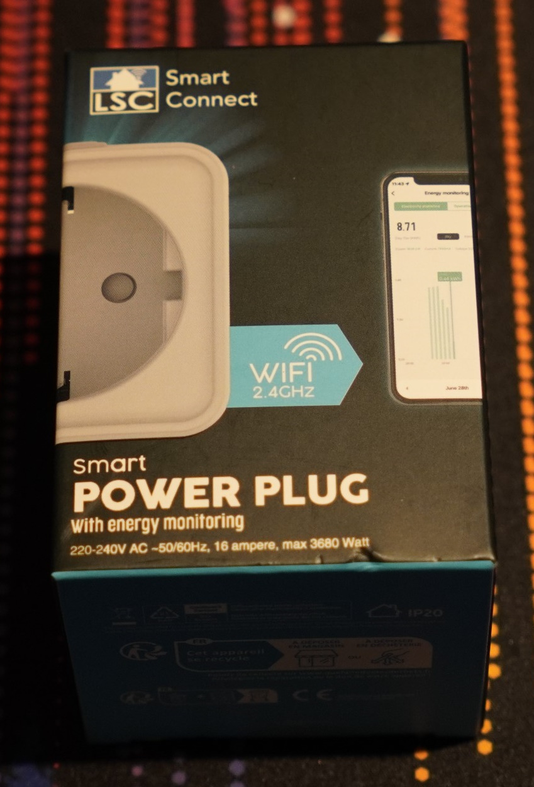

# LSC Smart Power Plug

This is a 16A 220-240VAC Smart power plug with energy monitoring ([Link to buy](https://www.action.com/nl-nl/p/3202087/lsc-smart-connect-slimme-stekker/)).




> **WARNING** Opening this devices can be dangerous because of main voltage. NEVER PLUG THIS DEVICE IN WHILE ITS OPEN. If you have no experience with opening up devices and soldering, do not continue.

> **INFO** Due to a bug with the pulse_counter component inside ESPHome ([issue](https://github.com/esphome/issues/issues/5327)) power monitoring is currently not working correctly. See [power minitoring patch](#power-monitoring-patch) for a temporary patch.

## Required tools

- A soldering iron
- Desoldering wick (because a chip needs to be remove for flasing)
- A USB to TTL converter
- Small plastic tools, or a flat screwdriver for opening
- Some wire
- Time

## Opening up the device


## Prepairing the chip for flashing

You will need to remove the main chip (CB2S) for flashing, then you will need to connect the 3.3V, GND, TX and RX pins to an USB to TTL converter.


After the wires are connected you can use the [ltchiptool](https://docs.libretiny.eu/docs/flashing/tools/ltchiptool/) for flashing the chip with the provided firmware.

## Power monitoring patch

Currently due to a bug in the pulse_counter component, the power monitoring isn't working. But this can easly be fixed by chaning a few lines in the code.

```diff
+++ "esphome/components/pulse_counter/pulse_counter_sensor.cpp"
@@ -24,6 +24,9 @@
   if (discard)
     return;
 
+  arg->counter++;
+  return;
+
   PulseCounterCountMode mode = arg->isr_pin.digital_read() ? arg->rising_edge_mode : arg->falling_edge_mode;
   switch (mode) {
     case PULSE_COUNTER_DISABLE:
@@ -40,7 +43,7 @@
   this->pin = pin;
   this->pin->setup();
   this->isr_pin = this->pin->to_isr();
-  this->pin->attach_interrupt(BasicPulseCounterStorage::gpio_intr, this, gpio::INTERRUPT_ANY_EDGE);
+  this->pin->attach_interrupt(BasicPulseCounterStorage::gpio_intr, this, gpio::INTERRUPT_RISING_EDGE);
   return true;
 }
 pulse_counter_t BasicPulseCounterStorage::read_raw_value() 
```

Or you can use my external component that has this fix applied: 

```yaml
external_components:
  - source:
      type: git
      url: https://github.com/wjtje/esphome
      ref: lsc-power-monitoring-fix
    components: [ pulse_counter ]
```

## Example yaml

This is a basic YAML file you can use to create your own firmware

```yaml
substitutions:
  name: "lsc-power-plug"
  friendly_name: "LSC Power Plug"
  encryption_key: ""
  ota_password: ""
  wifi_ssid: !secret wifi_ssid
  wifi_password: !secret wifi_password
  ap_password: ""

packages:
  power-plug: github://wjtje/lsc-smart-connect-esphome/power-plug/power-plug-package.yaml@main
```

## License

The MIT License (MIT) - Copyright (c) 2024 Wouter van der Wal
